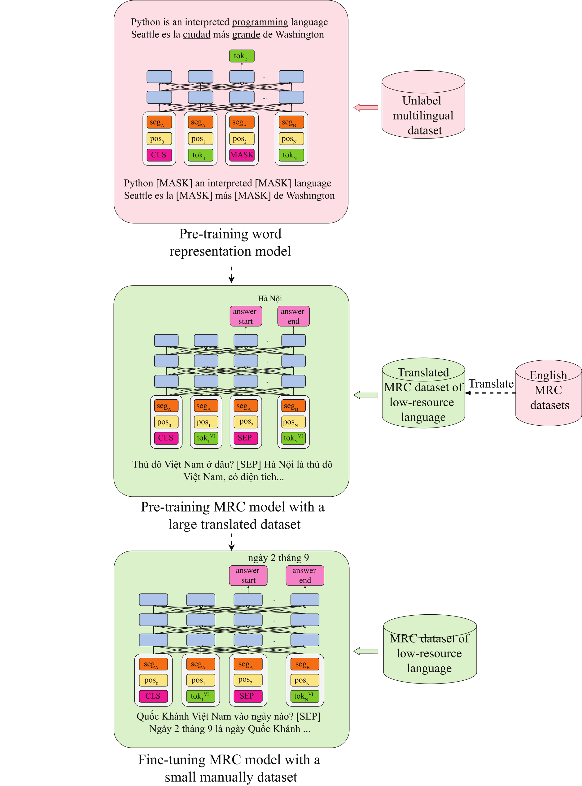
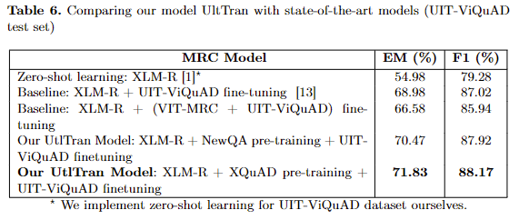

# Improve UtlTran with BLANC technique
## Result on ViQuAD test dataset
  - Exact Match (EM): 71.83 -> 73.92
  - F1-score (F1): 88.17 -> 89.87

# Original UtlTran Approach
## Machine Reading Comprehension Model for Low-Resource Languages and Experimenting on Vietnamese

**Nguyen Hoang Tien Bach, Nguyen Manh Dung, Nguyen Thi Thu Trang** | [Paper](https://link.springer.com/chapter/10.1007/978-3-031-08530-7_31)

HUST, LAB 914

### Abstract
Machine Reading Comprehension (MRC) is a challenging task in natural language processing. In recent times, many large datasets and good models are public for this task, but most of them are for English only. Building a good MRC dataset always takes much effort, this paper proposes a method, called UtlTran, to improve the MRC quality for low-resource languages. In this method, all available MRC English datasets are collected and translated into the target language with some context-reducing strategies for better results. Tokens of question and context are initialized word representations using a word embedding model. They are then pre-trained with the MRC model with the translated dataset for the specific low-resource language. Finally, a small manual MRC dataset is used to continue fine-tuning the model to get the best results. The experimental results on the Vietnamese language show that the best word embedding model for this task is a multilingual one – XLM-R. Whereas, the best translation strategy is to reduce context by answer positions. The proposed model gives the best quality, i.e. F1=88.2% and Exact Match (EM) = 71.8%, on the UIT-ViQuAD dataset, compared to the state-of-the-art models.

### Overview of UtlTran

<p align="center"></p>


### Result

<p align="center"></p>

### How to cite

```
@inproceedings{nguyen2022machine,
  title={Machine Reading Comprehension Model for Low-Resource Languages and Experimenting on Vietnamese},
  author={Nguyen, Bach Hoang Tien and Nguyen, Dung Manh and Nguyen, Trang Thi Thu},
  booktitle={International Conference on Industrial, Engineering and Other Applications of Applied Intelligent Systems},
  pages={370--381},
  year={2022},
  organization={Springer}
}
```
